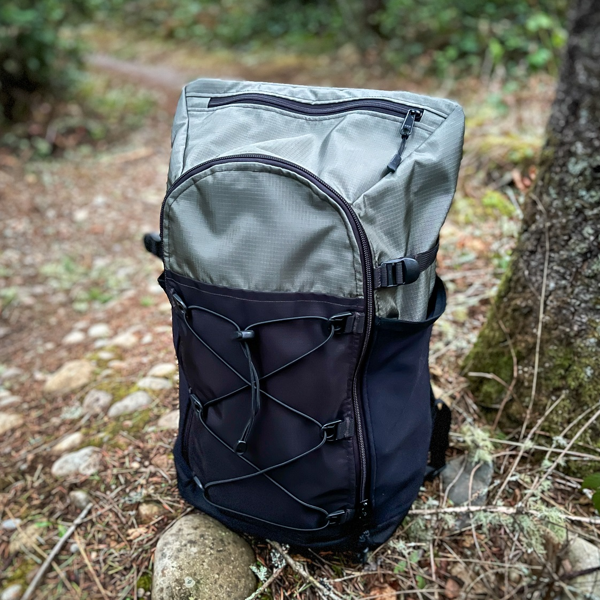
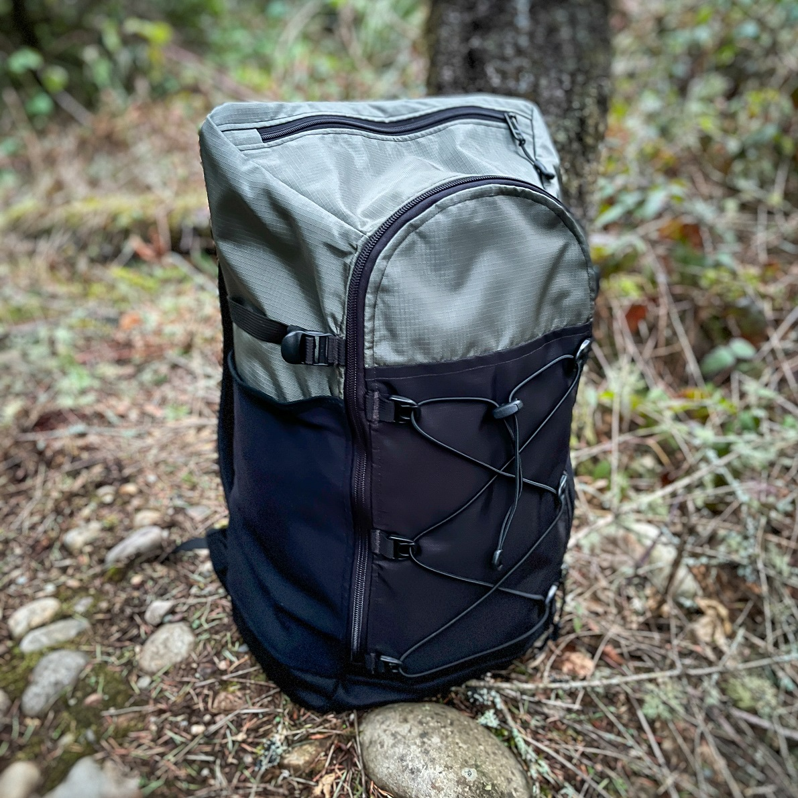
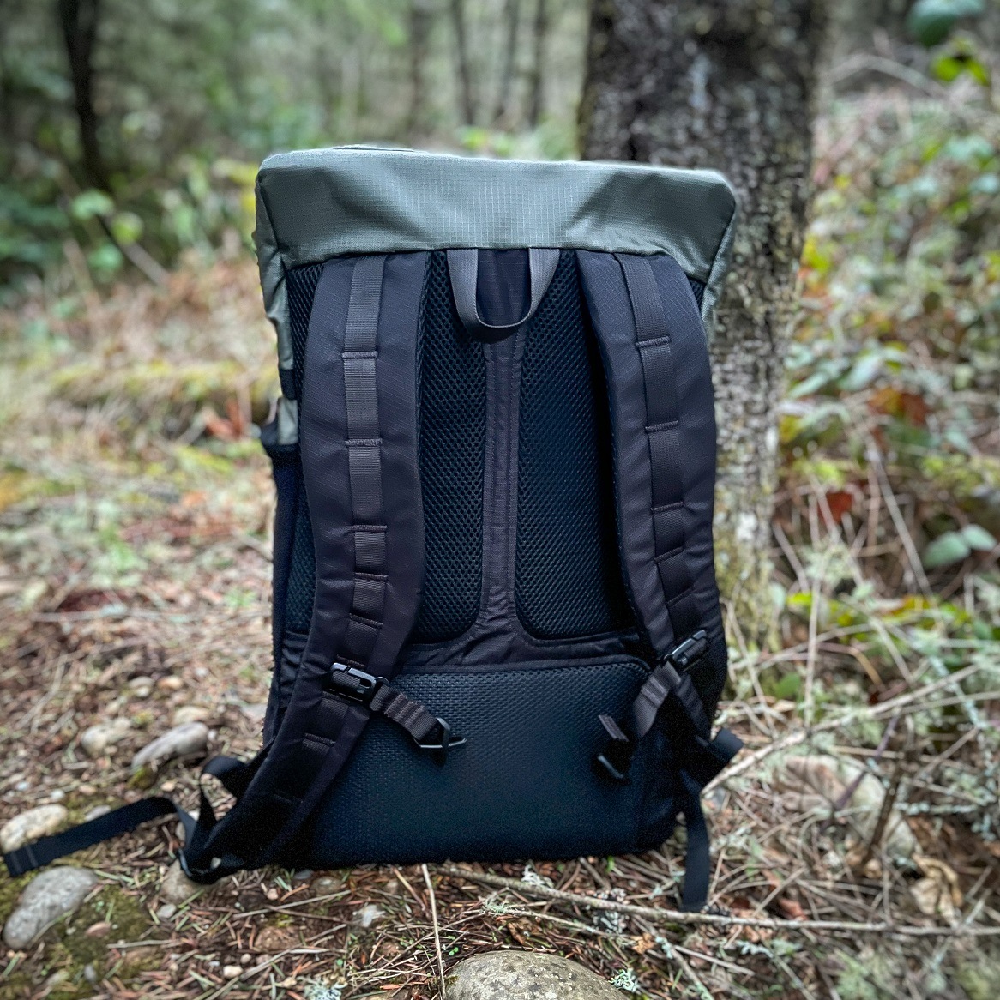
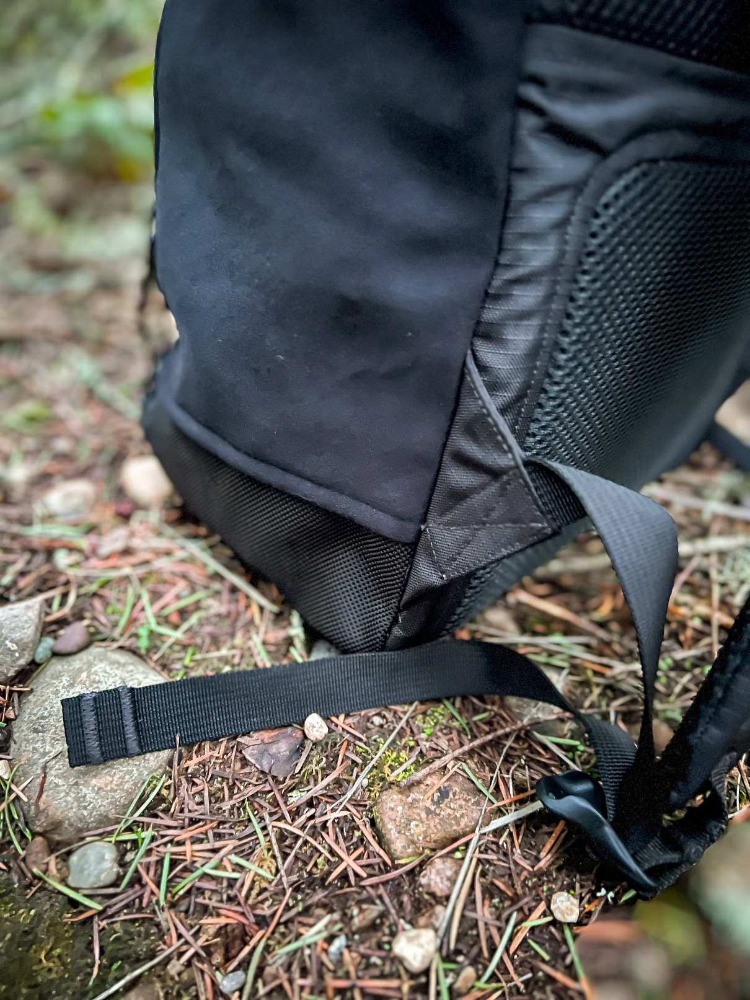
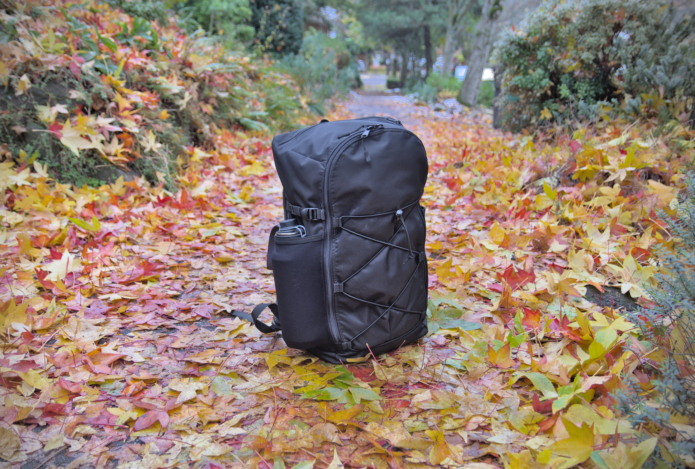
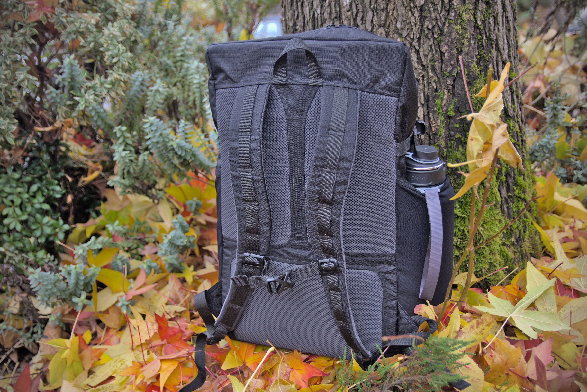
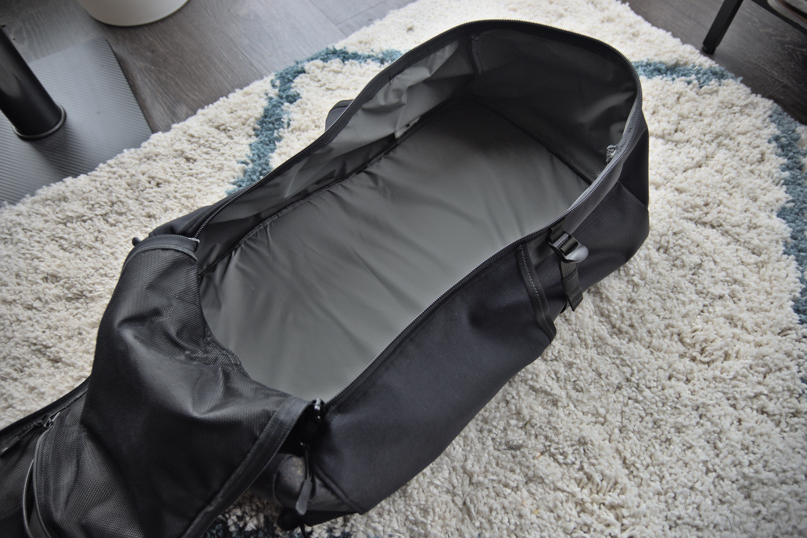
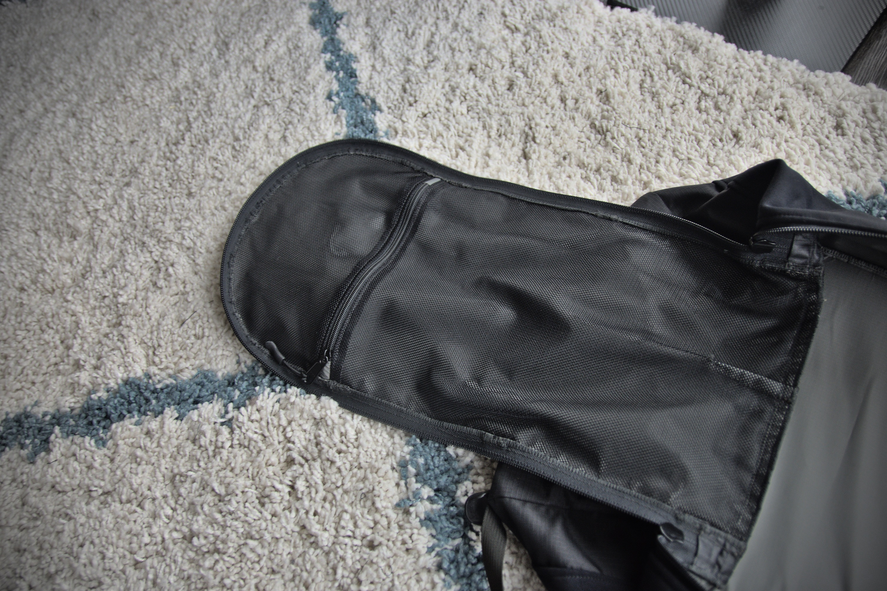

Copyright 2023 Anthony Needles. All rights reserved.

**Table of Contents**
- [NN JackPack v2](#nn-jackpack-v2)
  - [Fabrics](#fabrics)
  - [Total Components](#total-components)
- [Gallery](#gallery)
  - [v2](#v2)
  - [v1 (prototype)](#v1-prototype)
- [Change Log](#change-log)
  - [v2](#v2-1)

# NN JackPack v2

The JackPack is a "Jack-of-all-trades" backpack. I designed it out of a need for a moderately sized, well-structured backpack I could use when traveling overnight or over a weekend. It isn't specifically ultralight, isn't specifically meant for backpacking, isn't specifically meant for day use, it's just a well-rounded backpack.

Released: January 9th, 2023

Dimensions: 11" x 7" x 20"

Capacity ~30L

Weight: 24 oz.

Features:
- Top zipper pocket
- Interior zipper pocket
- Main body zipper
- Compression straps
- Large side stretch pockets
- Sternum strap
- Interior lining
- Rigid foam back
- Back panel with spacer mesh and air channels

## Fabrics

| Name                       | Approximate Size | Example Materials |
| -                          | -                | - |
| **SHELL FABRIC**           | 1 linear ft.     | 420D ROBIC |
| **LINING FABRIC**          | 1 linear ft.     | 1.9 oz PU-coated Ripstop Nylon |
| **STRETCH FABRIC**         | 8" x 24"         | Spandura |
| **SPACER MESH**            | 24" x 20"        | 1/4" Spacer Mesh |
| **INTERIOR POCKET LINING** | 10" x 18"        | 3.4 oz. Pocket Mesh |
| **THIN FOAM**              | 11" x 22"        | 4mm (or 1/8") EVA Foam |
| **THICK FOAM**             | 24" x 20"        | 6mm (or 1/4") EVA Foam |

## Total Components

| Name                 | Number | Size |
| -                    | -      | - |
| 3/4" WEBBING         | -      | 136" |
| 3/4" LADDER LOCK     | 4      | - |
| 3/4" BUCKLE          | 1      | - |
| 3/4" STRAP SLIDER    | 2      | - |
| 3/4" ELASTIC         | -      | 7.5" |
| 3/4" (3mm) CORDAGE   | -      | 70" |
| CORDAGE LOCK         | 1      | - |
| BEASTEE DEE RING     | 6      | - |
| #5 YKK ZIPPER COIL   | -      | 18.5" |
| #5 YKK ZIPPER SLIDER | 2      | - |
| ZIPPER PULL          | 4      | - |
| #8 YKK ZIPPER COIL   | 1      | 36" |
| #8 YKK ZIPPER SLIDER | 2      | - |
| 1" ELASTIC BIAS TAPE | 2      | 8" |

# Gallery

## v2

## v1 (prototype)

 

# Change Log

## v2

Redesign of the top, making it more slim. Reduced height of front and the top now slopes downwards from back to front. Added thin foam to the back spacer mesh pads.

- Updated pattern numbers and names
- Updated fabric numbers and names
- Increased length of C5 (front cordage) webbing parts
- Added C5 (front cordage) dee rings
- Increased length of C6 (compressor straps) webbing parts
- Added P2 (back foam lower) and P3 (back foam upper)
- Shrinked P10 (front panel) vertical length down by 2 1/2"
- Moved P10 (front panel) top webbing loops down 1/4"
- Moved P10 (front panel) top webbing loops down 1/8"
- Shrinked P11 (interior pocket lower) vertical down 1 1/4"
- Shrinked P12 (interior pocket upper) vertical down 1 1/4"
- Moved P13 (side panel lining) top of front-side down 1"
- Moved P14 (side panel upper) top of front-side down 1"
- Moved P14 (side panel upper) tension straps down 1/4"
- Shrinked P16 (side pocket) vertical length down 1/2"
- Englargened P17 (shoulder strap) and P19 (shoulder strap foam), added two more sternum strap loops
- Resized P20 (top panel back), P21 (top panel front), P22 (top panel lining) to match sides and front edge