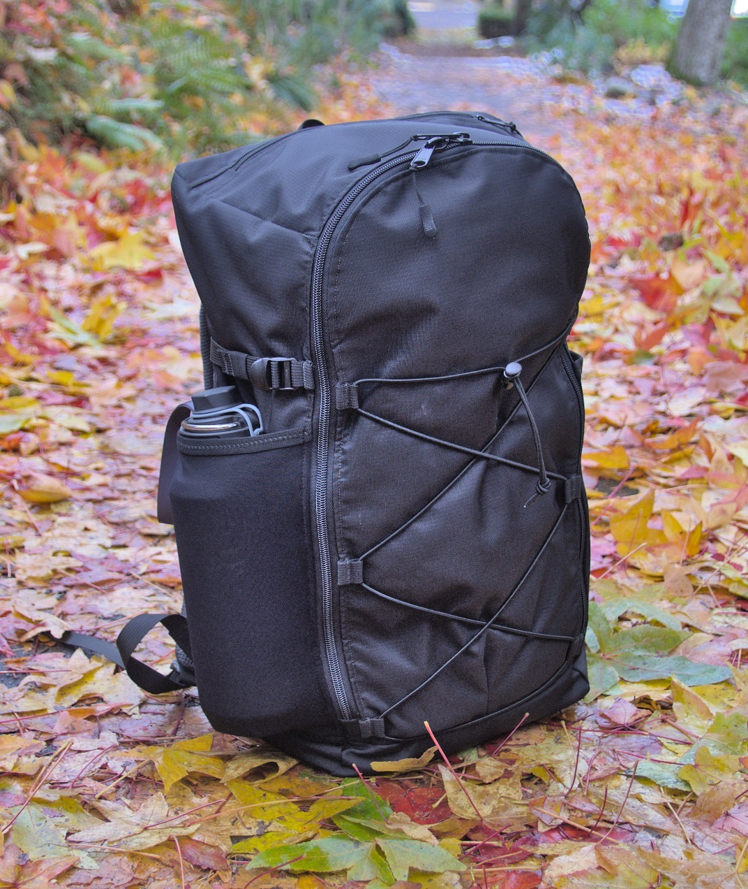
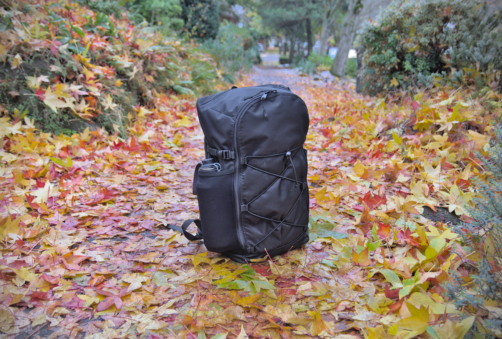
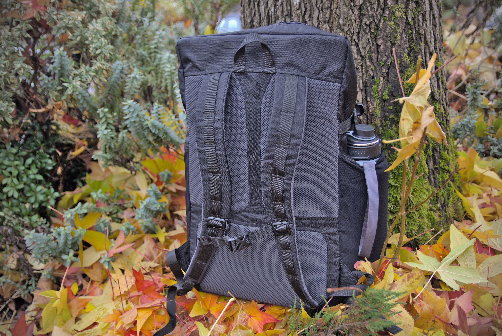
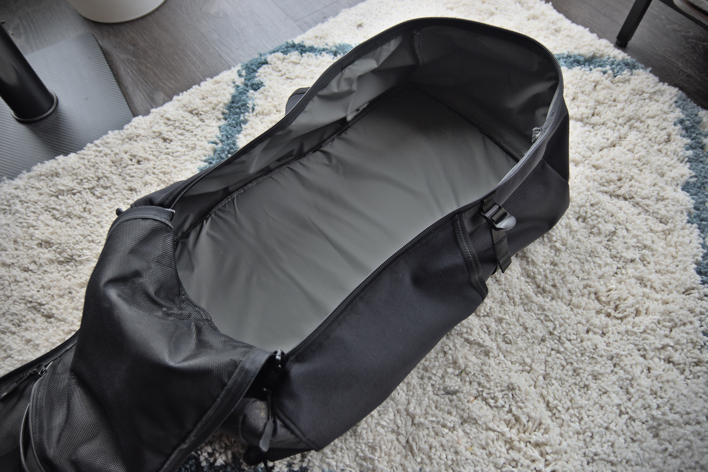
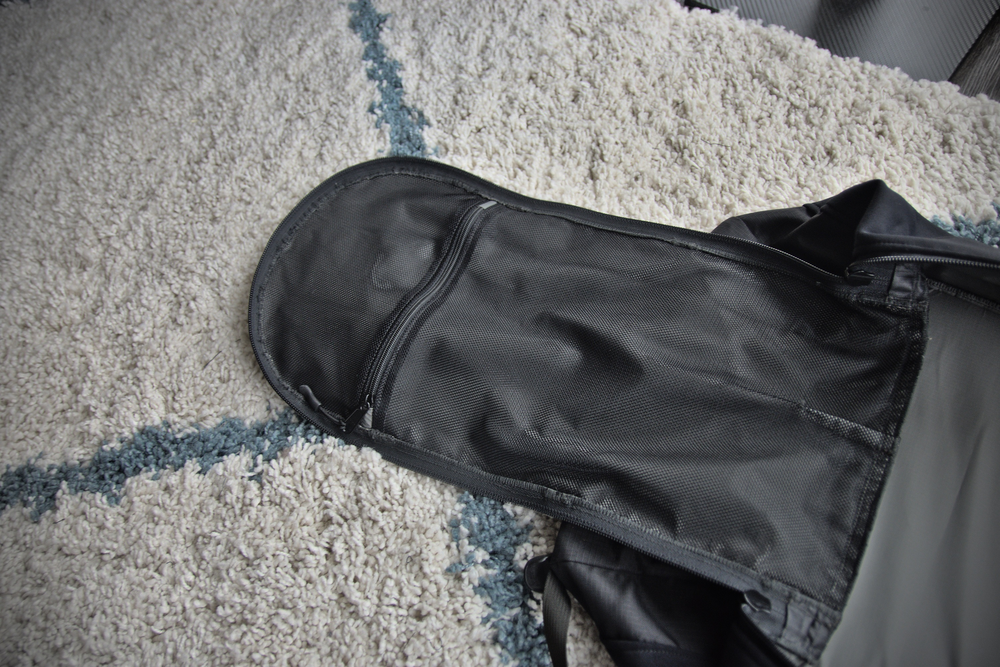

Copyright 2022 Anthony Needles. All rights reserved.

# NN JackPack v1

The JackPack is a "Jack-of-all-trades" backpack. I designed it out of a need for a moderately sized, well-structured backpack I could use when traveling overnight or over a weekend. It isn't specifically ultralight, isn't specifically meant for backpacking, isn't specifically meant for day use, it's just a well-rounded backpack.

Released: December 4th, 2022

Dimensions: 11" x 7" x 20"

Capacity ~30L

Weight: 21 oz.

Features:
- Top zipper pocket
- Interior zipper pocket
- Main body zipper 
- Compression straps
- Large side stretch pockets
- Sternum strap
- Interior lining
- Rigid foam back
- Back panel with spacer mesh and air channels

## Fabrics

| Name                       | ID     | Approximate Size | Example Materials |
| -                          | -      | -                | - |
| **SHELL FABRIC**           | **F1** | 1 linear ft.     | 420D ROBIC |
| **LINING FABRIC**          | **F2** | 1 linear ft.     | 1.9 oz PU-coated Ripstop Nylon |
| **STRETCH FABRIC**         | **F3** | 8" x 24"         | Spandura |
| **FOAM**                   | **F4** | 24" x 20"        | 6mm EVA Foam |
| **SPACER MESH**            | **F5** | 24" x 20"        | 1/4" Spacer Mesh |
| **INTERIOR POCKET LINING** | **F6** | 11" x 20"        | 3.4 oz. Pocket Mesh |

## Total Components

| Name                 | Number | Size |
| -                    | -      | - |
| 3/4" WEBBING         | -      | 126" |
| 3/4" LADDER LOCK     | 4      | - |
| 3/4" BUCKLE          | 1      | - |
| 3/4" STRAP SLIDER    | 2      | - |
| 3/4" ELASTIC         | -      | 7.5" |
| 3/4" (3mm) CORDAGE   | -      | 70" |
| CORDAGE LOCK         | 1      | - |
| #5 YKK ZIPPER COIL   | -      | 20" |
| #5 YKK ZIPPER SLIDER | 2      | - |
| ZIPPER PULL          | 4      | - |
| #8 YKK ZIPPER COIL   | 1      | 45" |
| #8 YKK ZIPPER SLIDER | 2      | - |
| 1" ELASTIC BIAS TAPE | 2      | 8" |

# Gallery

 